# Aplikasi Pendaftaran Pasien RS

## A. Gambaran Umum Aplikasi

Aplikasi Pendaftaran Pasien RS ini merupakan aplikasi yang bekerja dibidang rumah sakit. Aplikasi ini dapat menampilkan grafik jumlah orang yang positif COVID-19 di Indonesia. Selain itu Aplikasi Pendaftaran Pasien RS ini juga memiliki fitur untuk mendaftarkan akun untuk aplikasi dengan syarat pasien sudah mendapatkan Nomor Rekam Medis dari rumah sakit. Pasien dapat langsung masuk kedalam aplikasi apabila sudah memiliki akun aplikasi yang sudah didaftarkan sebelumnya. Kegunaan atau fungsi-fungsi yang terdapat pada aplikasi ini akan dijelaskan lebih lanjut pada poin Kegunaan.

## B. Kegunaan

1. Melihat Info COVID-19

    

    
    
    Berikut merupakan tampilan dari menu Info COVID-19. Pada menu ini pengguna bisa melihat perkembangan kasus COVID-19 di Indonesia. Data ini diambil dari situs https://kawalcorona.com/. Fitur ini dapat memberikan informasi kepada pengguna mengenai jumlah kasus positif dan meninggal COVID-19 di Indonesia.
    

2. Daftar Akun Aplikasi

    

    
    
    Berikut merupakan tampilan dari menu Daftar Akun Aplikasi. Pada menu ini pengguna yang belum memiliki akun aplikasi ini, tetapi sudah memiliki Nomor Rekam Medis dari rumah sakit dapat mendaftarkan akun aplikasi dengan menggunakan Nomor Rekam Medis tersebut. Pengguna akan diminta untuk memasukkan NRM, Nama Lengkap, Jenis Kelamin, Tanggal lahir, Nomor telepon, Alamat, Email, Password, dan Konfirmasi Password.
    

3. Login

    

    

    Berikut merupakan tampilan dari menu Masuk(Login). Pada menu ini, pengguna yang sudah memiliki akun aplikasi dapat langsung melakukan login aplikasi menggunakan email dan password. Jika pengguna belum memiliki akun, maka pengguna dapat mengklik tombol Disini. Tombol ini nantinya akan mengarahkan pengguna ke halaman daftar. Dibawah merupakan halaman yang muncul setelah pengguna melakukan login.
    

    

4. Ambil Antrian

    

    

    Berikut merupakan tampilan dari menu Ambil Antrian. Pada halaman ini, pengguna dapat mengambil antrian berdasrkan tujuan poli rumah sakit dan tanggal. Setelah pengguna mendapatkan antrian, aplikasi akan langsung menampilkan bukti antrian yang nantinya harus disimpan oleh pengguna dalam bentuk screenshoot dan dibawa saat ke rumah sakit. Dibawah ini merupakan tampilan bukti antrian.
    

        

5. Konsultasi Online

    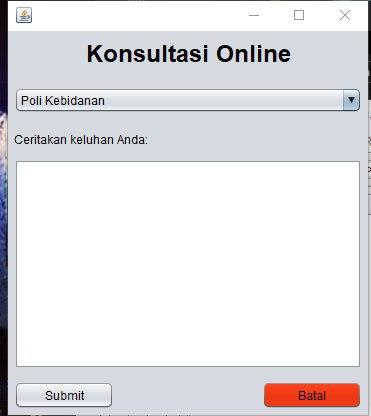

    

    Gambar di atas merupakan tampilan saat pengguna hendak melakukan konsultasi online. Pengguna hanya perlu memilih poli tujuan untuk berkonsultasi serta keluhannya pada *field* yang telah disediakan. Pengguna tidak perlu memasukkan informasi pribadi seperti nama, usia, jenis kelamain dan sebagainya karena aplikasi sudah secara otomatis mengidentifikasi id pengguna yang melakukan konsultasi online. Sehingga data-data pengguna sudah sesuai dengan data pada saat pengguna mendaftarkan diri di aplikasi.
    

    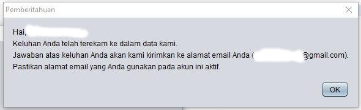

    

    Pemberitahuan seperti gambar di atas akan muncul apabila konsultasi pengguna berhasil tersimpan.
    

6. Lihat Antrian Saya

    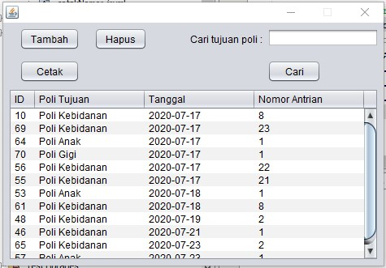

    

    Berikut merupakan tampilan dari menu Lihat Antrian Saya. Pada halaman ini, pengguna dapat melihat antrian yang dimiliki, selain itu pengguna juga dapat mencetak kembali bukti antrian dengan mengklik tombol cetak apabila bukti antrian sebelumnya hilang atau pengguna terlupa untuk menyimpan bukti antrian. Tombol Tambah pada halaman ini akan mengarahkan pengguna ke halaman Ambil Antrian. Tombol Hapus berfungsi untuk menghapus antrian pengguna yang dibatalkan. Kolom cari digunakan untuk mencari antrian berdasarkan Poli Tujuan.
    

7. Lihat/Edit Profil dan Ubah Password
    
    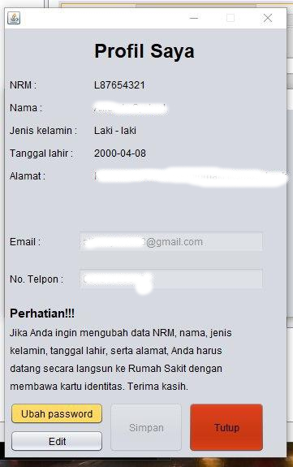

    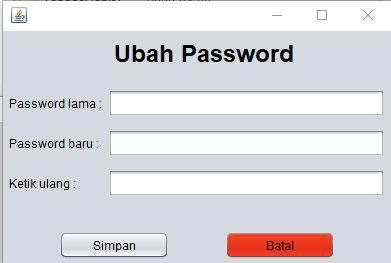

    

    Pada halaman ini, pengguna dapat melihat informasi tentang akunnya masing-masing. Informasi-informasi yang diberikan yaitu Nomor Rekam Medis, nama, jenis kelamin, tanggal lahir, alamat, nomor telpon, dan email. Pengguna juga dapat mengubah data pribadinya, tetapi hanya email dan nomor telpon yang dapat diubah. Selain kedua itu, pengguna diwajibkan langsung ke rumah sakit untuk mengubah data pribadinya dengan membawa kartu identitas. Kemudian, pengguna juga dapat mengubah password dari akun mereka.
    

## C. Fitur Keamanan

    1. Enkripsi password menggunakan SHA-256
    2. Pemberian sanitasi input pada setiap kolom input.
    3. Menggunakan PreparedStatement sehingga lebih aman terhadap SQL Injection

## D. Requirements/Library Yang Digunakan

    1. Java 8
    2. MySQL JDBC Driver
    3. LGoodDatePicker-10.4.1
    4. xchart-3.6.3
    5. json-20200518
    6. jasperreports-6.3.0
    7. httpcore-4.4.13
    8. httpclient-4.5.12
    9. groovy-2.4.15
    10. commons-logging-1.2
    11. commons-io-2.7
    12. commons-digester-2.1
    13. commons-collections-3.2.1
    14. commons-codec-1.14
    15. commons-beanutils-1.8.0

## E. Tata Cara Instalasi

1. Windows

    * Langkah pertama adalah install XAMPP untuk Windows. Download XAMPP terlebih dahulu pada https://www.apachefriends.org/download.html.

    * Jika XAMPP sudah terinstall. Selanjutnya unduh installer Aplikasi Pendaftaran Pasien RS versi Windows pada https://github.com/alfnonymous8/Aplikasi-Pendaftaran-Pasien-RS/releases/tag/v1.0.0 dan jalankan, maka akan muncul jendela seperti dibawah kemudian klik next.

        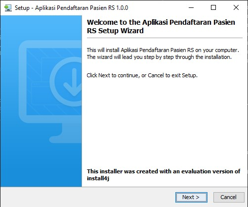
    
    * Pilih direktori insall, kemudian next.
    
        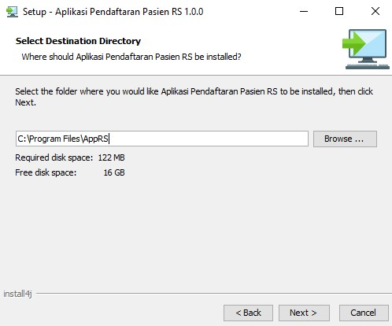
    
    * Menentukan apakah icon desktop akan dibuat atau tidak, kemudian next.
    
        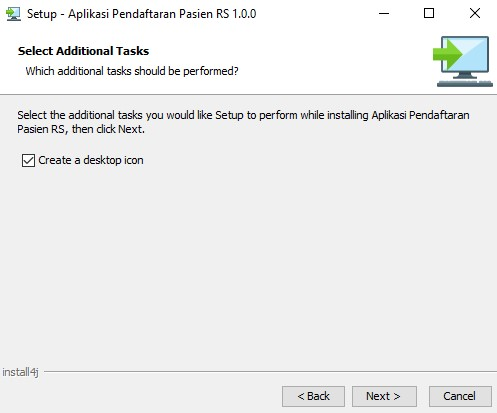
    
    * Tunggu sampai proses installasi selesai.
    
        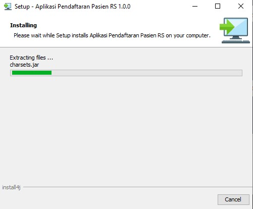
    
    * Masukkan username dan password MySQL anda, apabila anda tidak pernah mengubah username dan password MySQL maka lanjut klik next.
    
        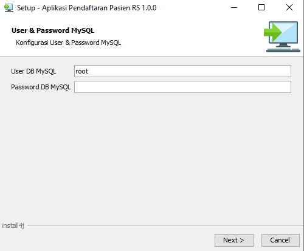
    
    * Klik finish.

        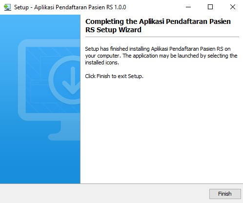
    
    * Jalankan aplikasi melalui shortcut pada desktop.

        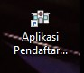

2. Linux

    * Langkah pertama adalah install XAMPP untuk Linux. Download XAMPP terlebih dahulu pada https://www.apachefriends.org/download.html.

    * Jika XAMPP sudah terinstall. Selanjutnya unduh installer Aplikasi Pendaftaran Pasien RS versi Linux pada https://github.com/alfnonymous8/Aplikasi-Pendaftaran-Pasien-RS/releases/tag/v1.0.0.

    * Buka terminal dan masuk kedalam direktori dimana installer Aplikasi Pendaftaran Pasien RS berada. jalankan perintah `chmod +x AppRS_linux_1_0_0.sh`.

    * Jalankan installer dengan mengetikkan perintah `./AppRS_linux_1_0_0.sh` pada direktori tersebut. Jika berhasil akan muncul jendela seperti berikut.

        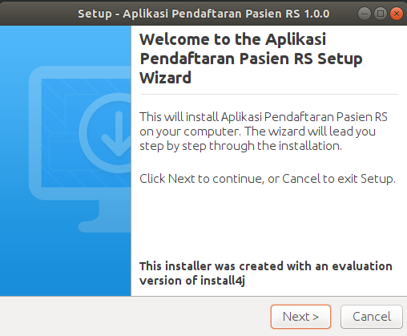
    
    * Pilih direktori insall, kemudian next.
    
        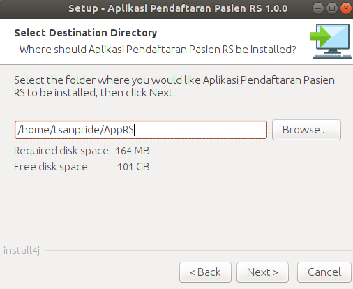
    
    * Menentukan apakah icon desktop akan dibuat atau tidak, kemudian next.
    
        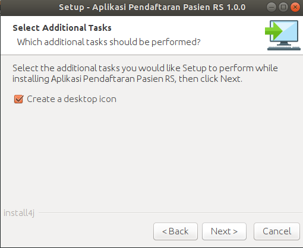
    
    * Tunggu sampai proses installasi selesai.
    
        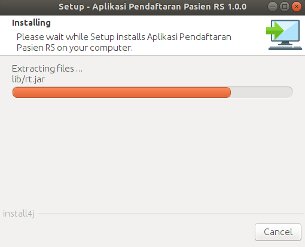
    
    * Masukkan username dan password MySQL anda, apabila anda tidak pernah mengubah username dan password MySQL maka lanjut klik next.
    
        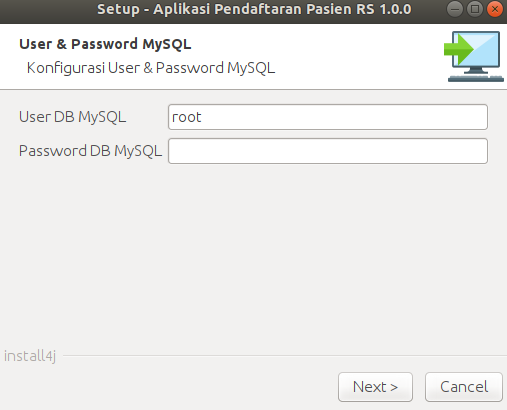
    
    * Klik finish.

        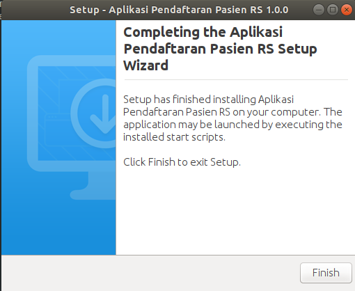
    
    * Jalankan aplikasi melalui shortcut pada desktop.

        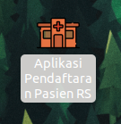

    * Klik Trust and Launch.

        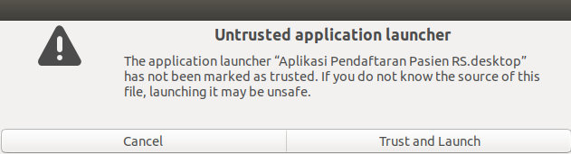

## F. Manual Penggunaan

1. Menjalankan Aplikasi

    

    Untuk menjalankan aplikasi, pengguna hanya perlu mengklik dua kali icon aplikasi yang ada di desktop. Setelah itu aplikasi akan berjalan dan menampilkan halaman *dashboard* seperti di bawah ini.
    

    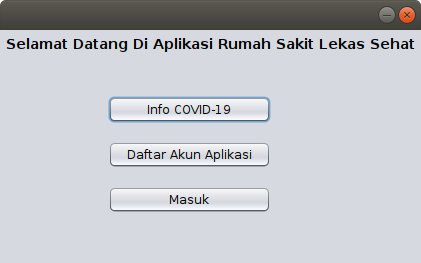

2. Melihat Informasi Perkembangan Kasus COVID-19 di Indonesia

    

    Dari halaman *dashboard*, pengguna dapat langsung mengklik tombol "Info COVID-19" untuk dapat melihat perkembangan kasus Covid-19 di Indonesia. Setelah diklik, otomatis akan muncul halaman baru yang menunjukkan grafik perkembangan kasus Covid-19 di Indonesia. 
    

    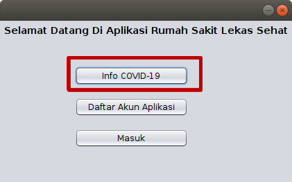

    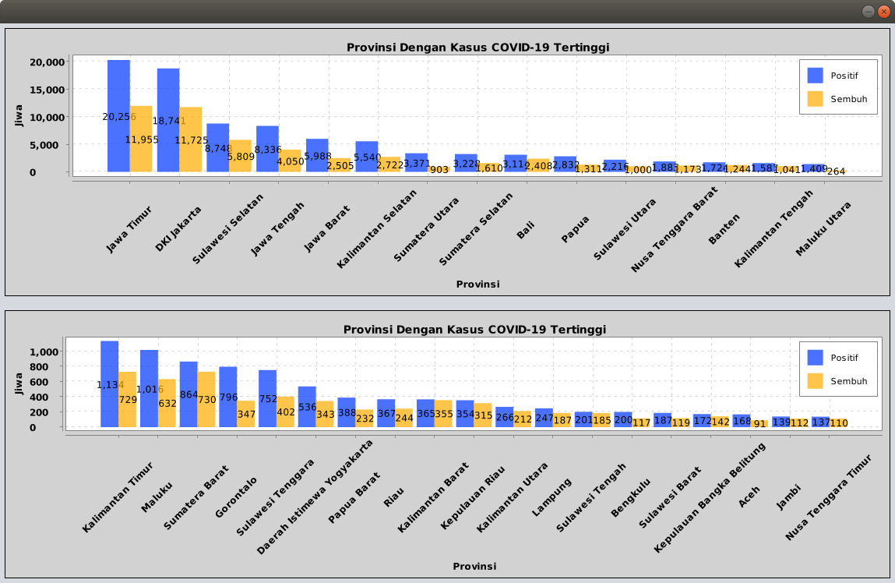

3. Melakukan Pendaftaran

    

    Untuk melakukan pendaftaran, dari halaman *dashboard* pengguna dapat mengklik tombol "Daftar Akun Aplikasi". Setelah tombol diklik, maka akan muncul jendela baru untuk melakukan pendaftaran. Sebelum melakukan pendaftaran di aplikasi, pengguna harus sudah terdaftar di Rumah Sakit dan memiliki Nomor Rekam Medis dari rumah sakit tersebut. Pengguna tidak akan bisa melakukan pendaftaran apabila tidak memiliki Nomor Rekam Medis. Isilah form yang ada pada jendela tersebut, dan jika sudah selesai klik tombol "Submit" di bagian paling bawah.
    

    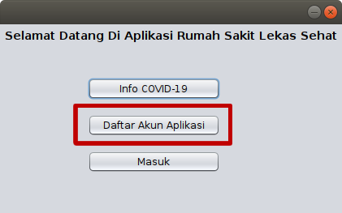

    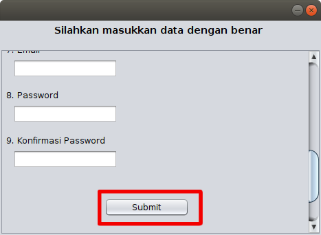

4. Melakukan login user

    

    Pengguna dapat melakukan login dengan mengklik tombol "Masuk" yang ada pada dashboard.
    

    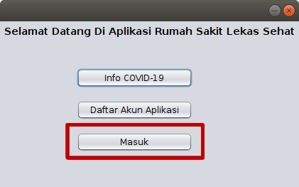

    

    Pada jendela login, masukkan email dan password pengguna yang sebelumnya telah didaftarkan. Kemudian klik tombol "Login" untuk masuk ke aplikasi.
    

    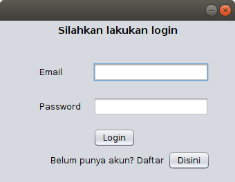

    

    Apabila email dan password yang dimasukkan benar, maka pengguna akan diarahkan ke sebuah jendela utama yang berisi fitur-fitur yang tersedia di aplikasi.
    

    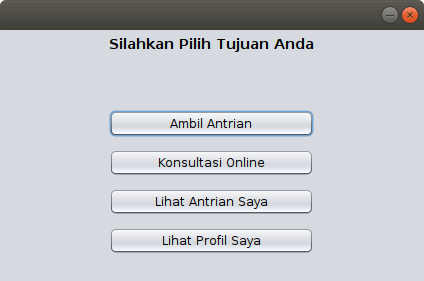

5. Mengambil antrian

    

    Dari menu utama, klik tombol "Ambil antrian" dan jendela baru akan terbuka. Kemudian pilihlah poli tujuan berobat serta tanggalnya. Setelah itu klik tombol "Ambil Antrian" pada jendela baru tersebut.
    

    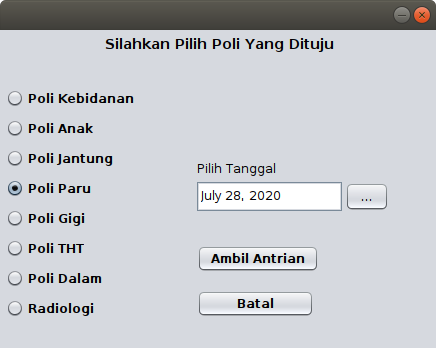

    

    Jika berhasil, maka akan muncul sebuah struk pada layar monitor yang akan digunakan sebagai bukti antrian. Simpanlah bukti antrian ini dan bawalah saat akan berobat ke rumah sakit.
    

    

6. Lihat daftar antrian saya

    

    Klik tombol "Lihat Antrian Saya" dari menu utama dan jendela baru akan terbuka. Pada jendela baru tersebut, akan ditampilkan daftar antrian dari pengguna baik yang sudah lewat maupun yang akan datang. Pengguna juga dapat mencari antriannya berdasarkan nama poli melalui kotak pencarian di sebelah kanan atas. Selain itu, pengguna juga dapat mencetak ulang bukti antrian dengan tombol "cetak", menghapus antrian yang sudah ada dengan tombol "Hapus", serta menambah antrian dengan tombol "Tambah". Apabila pengguna mengklik tombol "Tambah" maka pengguna akan diarahkan kembali ke jendela Ambil Antrian sebelumnya.
    

    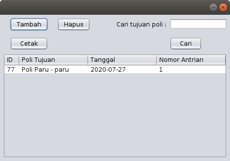

7. Konsultasi online

    

    Untuk melakukan konsultasi online, pengguna dapat mengklik tombol "Konsultasi Online" pada menu utama. Pada jendela konsultasi online, pengguna cukup memilih poli tujuan konsultasi serta menceritakan keluhan pada *textfield* yang tersedia. Keluhan yang diceritakan tidak diperbolehkan terlalu pendek. Usahakan isi keluhan dengan sejelas-jelasnya sehingga dokter juga dapat membantu memberikan solusi. Apabila telah selesai, klik tombol "Submit" untuk mengirimkan keluhan anda ke poli terkait.
    

    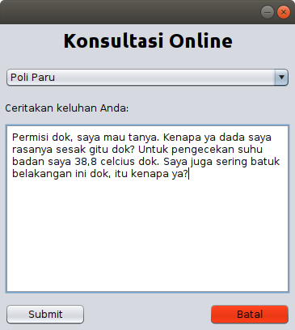

8. Melihat dan mengedit profil serta password
    
    

    Untuk melihat profil pengguna, klik tombol "Lihat Profil Saya" pada menu utama. Setelah itu akan muncul jendela yang memberikan informasi profil pengguna.  Pengguna dapat mengubah alamat email serta nomor telponnya dengan mengklik tombol "Edit" pada bagian bawah kiri. Apabila telah selesai melakukan perubahan, simpan perubahan tersebut dengan mengklik tombol "Simpan". Kemudian, untuk mengubah password pengguna dapat mengklik tombol "Ubah password" dan jendela baru akan terbuka. Pada jendela tersebut, isikan password lama pengguna serta password baru. Klik tombol "Simpan" jika sudah selesai.
    

    

    