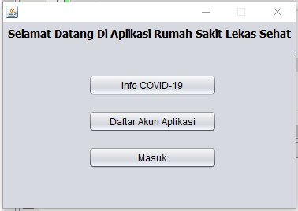
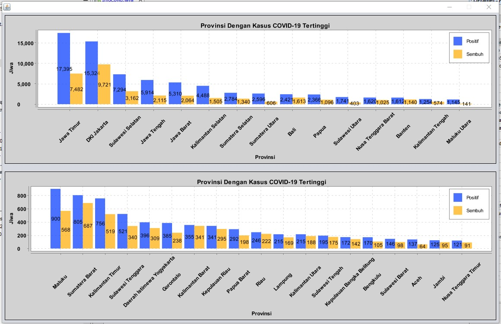
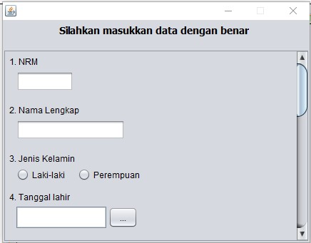
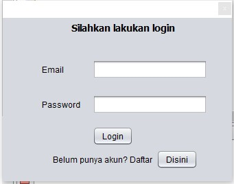
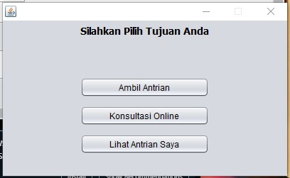
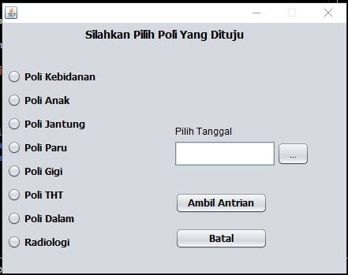
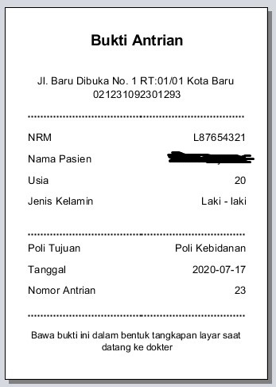

# Aplikasi Pendaftaran Pasien RS

## A. Gambaran Umum Aplikasi

Aplikasi Pendaftaran Pasien RS ini merupakan aplikasi yang bekerja dibidang rumah sakit. Aplikasi ini dapat menampilkan grafik jumlah orang yang positif COVID-19 di Indonesia. Selain itu Aplikasi Pendaftaran Pasien RS ini juga memiliki fitur untuk mendaftarkan akun untuk aplikasi dengan syarat pasien sudah mendapatkan Nomor Rekam Medis dari rumah sakit. Pasien dapat langsung masuk kedalam aplikasi apabila sudah memiliki akun aplikasi yang sudah didaftarkan sebelumnya. Kegunaan atau fungsi-fungsi yang terdapat pada aplikasi ini akan dijelaskan lebih lanjut pada poin Kegunaan.

## B. Kegunaan

1. Melihat Info COVID-19

    

    
    
    Berikut merupakan tampilan dari menu Info COVID-19. Pada menu ini pengguna bisa melihat perkembangan kasus COVID-19 di Indonesia. Data ini diambil dari situs https://kawalcorona.com/. Fitur ini dapat memberikan informasi kepada pengguna mengenai jumlah kasus positif dan meninggal COVID-19 di Indonesia.
    

2. Daftar Akun Aplikasi

    

    
    
    Berikut merupakan tampilan dari menu Daftar Akun Aplikasi. Pada menu ini pengguna yang belum memiliki akun aplikasi ini, tetapi sudah memiliki Nomor Rekam Medis dari rumah sakit dapat mendaftarkan akun aplikasi dengan menggunakan Nomor Rekam Medis tersebut. Pengguna akan diminta untuk memasukkan NRM, Nama Lengkap, Jenis Kelamin, Tanggal lahir, Nomor telepon, Alamat, Email, Password, dan Konfirmasi Password.
    

3. Login

    

    

    Berikut merupakan tampilan dari menu Masuk(Login). Pada menu ini, pengguna yang sudah memiliki akun aplikasi dapat langsung melakukan login aplikasi menggunakan email dan password. Jika pengguna belum memiliki akun, maka pengguna dapat mengklik tombol Disini. Tombol ini nantinya akan mengarahkan pengguna ke halaman daftar. Dibawah merupakan halaman yang muncul setelah pengguna melakukan login.
    

    

4. Ambil Antrian

    

    

    Berikut merupakan tampilan dari menu Ambil Antrian. Pada halaman ini, pengguna dapat mengambil antrian berdasrkan tujuan poli rumah sakit dan tanggal. Setelah pengguna mendapatkan antrian, aplikasi akan langsung menampilkan bukti antrian yang nantinya harus disimpan oleh pengguna dalam bentuk screenshoot dan dibawa saat ke rumah sakit. Dibawah ini merupakan tampilan bukti antrian.
    

        

5. Konsultasi Online

    Coming Soon!

6. Lihat Antrian Saya

    

    

    Berikut merupakan tampilan dari menu Lihat Antrian Saya. Pada halaman ini, pengguna dapat melihat antrian yang dimiliki, selain itu pengguna juga dapat mencetak kembali bukti antrian dengan mengklik tombol cetak apabila bukti antrian sebelumnya hilang atau pengguna terlupa untuk menyimpan bukti antrian. Tombol Tambah pada halaman ini akan mengarahkan pengguna ke halaman Ambil Antrian. Tombol Hapus berfungsi untuk menghapus antrian pengguna yang dibatalkan. Kolom cari digunakan untuk mencari antrian berdasarkan Poli Tujuan.
    

## C. Fitur Keamanan

    1. Enkripsi password menggunakan SHA-256
    2. Pemberian sanitasi input pada setiap kolom input.

## D. Requirements/Library Yang Digunakan

    1. Java 8
    2. MySQL JDBC Driver
    3. LGoodDatePicker-10.4.1
    4. xchart-3.6.3
    5. json-20200518
    6. jasperreports-6.3.0
    7. httpcore-4.4.13
    8. httpclient-4.5.12
    9. groovy-2.4.15
    10. commons-logging-1.2
    11. commons-io-2.7
    12. commons-digester-2.1
    13. commons-collections-3.2.1
    14. commons-codec-1.14
    15. commons-beanutils-1.8.0

## E. Tata Cara Instalasi

## F. Manual Penggunaan